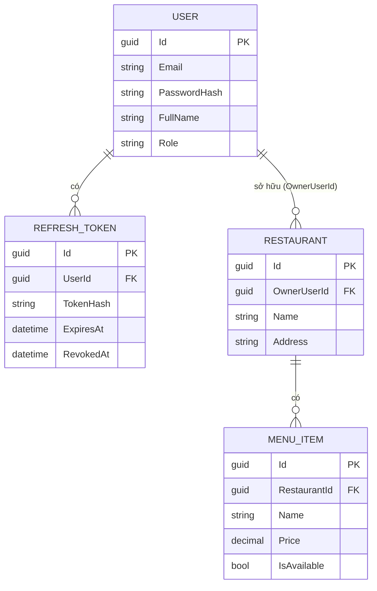

# Sơ đồ ER nháp: Xác thực và Quản lý quán

```mermaid
erDiagram
    USER ||--o{ REFRESH_TOKEN : "có"
    USER ||--o{ RESTAURANT : "sở hữu (OwnerUserId)"
    RESTAURANT ||--o{ MENU_ITEM : "có"

    USER {
        guid Id PK
        string Email
        string PasswordHash
        string FullName
        string Role
    }
    REFRESH_TOKEN {
        guid Id PK
        guid UserId FK
        string TokenHash
        datetime ExpiresAt
        datetime RevokedAt
    }
    RESTAURANT {
        guid Id PK
        guid OwnerUserId FK
        string Name
        string Address
    }
    MENU_ITEM {
        guid Id PK
        guid RestaurantId FK
        string Name
        decimal Price
        bool IsAvailable
    }
```